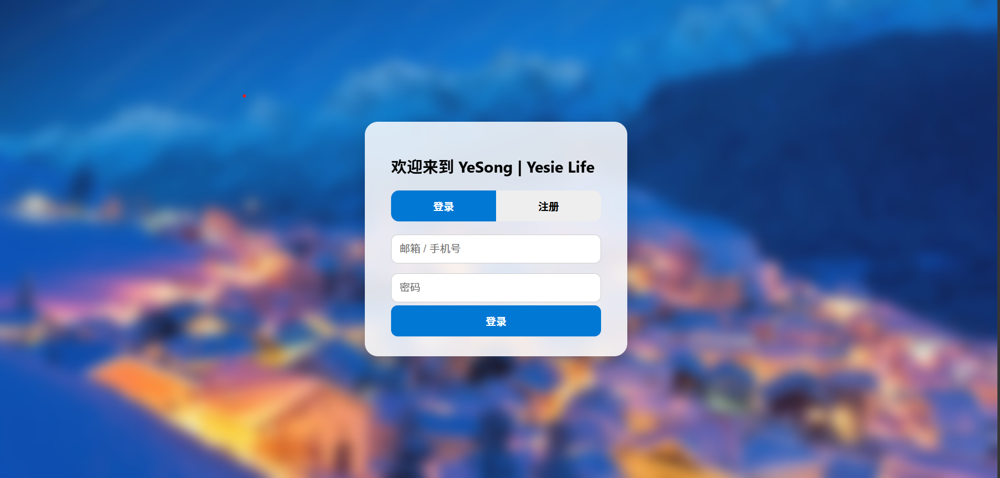

# YesieLife Login 🔐

**YesieLife Login - Authentication System Source Code**

[中文介绍](#中文介绍) | [English](#english)

---

# 中文介绍

## 项目简介

YesieLife Login 是 YesieLife 生态中的登录注册系统项目。

本项目提供用户登录与注册页面，为 YesieLife 网站提供基础用户认证功能。

仓库保存 YesieLife Login 登录注册网页的源代码，包括页面结构、样式设计、交互逻辑以及相关数据目录。

---

## 项目特点

- 🔐 用户登录与注册界面
- 🔄 登录 / 注册双页面切换
- 🎨 毛玻璃风格 UI 设计
- 📱 响应式移动端适配
- ⚡ 前端表单实时验证
- 🔗 API 接口交互
- 🗂️ 用户数据管理结构

---

## 功能介绍

### 用户登录

支持：

- 邮箱 / 手机号账号登录
- 密码验证
- 登录错误提示
- API 请求处理

登录接口：

```
POST /api/login.php
```

---

### 用户注册

支持：

- 新用户注册
- 密码确认
- 密码长度检查
- 可选认证码
- 注册结果反馈

注册接口：

```
POST /api/register.php
```

---

### UI 设计

项目采用现代化登录界面设计：

- 半透明卡片布局
- 背景图片展示
- 毛玻璃模糊效果
- 圆角组件设计
- 动态交互效果

---

## 技术栈

### Front-end

- HTML
- CSS
- JavaScript

### Backend Interface

- PHP API

### Development Tools

- Visual Studio Code
- Git & GitHub

---

## 项目结构

```
YesieLife-login/
├── css/                         # 样式文件
├── data/                        # 数据相关文件
├── html/                        # 页面文件
├── js/                          # JavaScript 文件
├── json/                        # JSON 数据文件
├── users/                       # 用户数据目录
│
├── index.html                   # 登录注册主页
├── 9129d2a83b8a6b98d09e143a445681a1.png
│                                # 登录背景图片
└── photo145342.png              # 页面截图
```

---

## 页面截图



---

## 在线访问

官方网站：

https://yesongchina.com

---

## 开发计划

未来可能继续完善：

- 🔑 更安全的用户认证机制
- 📧 邮箱验证功能
- 🔒 密码加密存储
- 👤 用户中心页面
- 🌐 第三方登录支持

---

## 开源说明

本项目主要用于：

- Web 登录系统开发学习
- 用户认证功能实践
- YesieLife 网站生态建设

欢迎查看代码并提出改进建议。

---

# English

## Introduction

YesieLife Login is an authentication system project in the YesieLife ecosystem.

This project provides user login and registration interfaces for basic user authentication features.

This repository contains the source code of the YesieLife Login system, including page structure, UI design, interaction logic and related data directories.

---

## Features

- 🔐 User login and registration interface
- 🔄 Login/Register tab switching
- 🎨 Glassmorphism UI design
- 📱 Responsive mobile support
- ⚡ Front-end form validation
- 🔗 API communication
- 🗂️ User data management structure

---

## Functions

### Login System

Supports:

- Email / phone account login
- Password validation
- Error messages
- API request handling

API:

```
POST /api/login.php
```

---

### Registration System

Supports:

- User registration
- Password confirmation
- Password length checking
- Optional verification code
- Registration feedback

API:

```
POST /api/register.php
```

---

## UI Design

The project uses a modern authentication interface:

- Transparent card layout
- Background image
- Glassmorphism effect
- Rounded components
- Interactive animations

---

## Technologies

### Front-end

- HTML
- CSS
- JavaScript

### Backend Interface

- PHP API

### Development Tools

- Visual Studio Code
- Git & GitHub

---

## Project Structure

```
YesieLife-login/
├── css/
├── data/
├── html/
├── js/
├── json/
├── users/
│
├── index.html
├── 9129d2a83b8a6b98d09e143a445681a1.png
└── photo145342.png
```

---

## Website

Visit:

https://yesongchina.com

---

## Roadmap

Future improvements:

- More secure authentication
- Email verification
- Encrypted password storage
- User center page
- Third-party login support

---

## License

This project is created for web development learning, authentication system practice and YesieLife ecosystem development.

Feel free to explore the source code and share suggestions.

---

Made with ❤️ by King Feng
